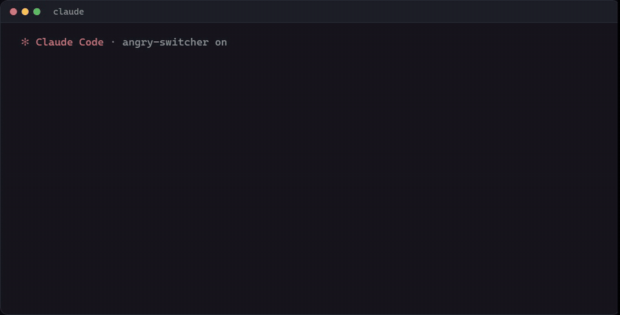

<div align="center">

# Angry Switcher

**Swear at Claude Code all you like. It reads the clean version.**

[](LICENSE)
[](https://github.com/timoncool/angry-switcher/stargazers)
[](https://github.com/timoncool/angry-switcher/commits)
[](https://timoncool.github.io/angry-switcher/)

**[English](README.md)** · **[Русский](README_RU.md)**



</div>

Angry Switcher is a Claude Code plugin that rewrites every prompt before Claude reads it. Typos, translit, the wrong keyboard layout, swearing and caps go; every request, question, path and number stays. Think Grammarly for your prompts, except it fixes what you meant, not just the spelling.

## How it started

On October 8, 2026 Anthropic [updated its usage policy](https://techcrunch.com/2026/10/08/anthropic-changes-usage-policy-to-ban-model-abuse-and-election-interference/): repeated, pointless cruelty toward its models is now against the rules. Plenty of people swear at Claude Code because it feels like it works. We checked the research: tone barely changes answer quality, and a rant carries no diagnostics. So now a small, fast model sits between the keyboard and Claude.

## Features

- **Cleans the surface:** typos, translit (`pochini test`), wrong layout (`ghbdtn` → `привет`), swearing, caps, filler
- **Copy-edits, never rephrases:** questions stay questions, requests stay requests, nothing is added
- **Keeps the details:** paths, identifiers, numbers, code and quotes must survive, or your original goes out as typed
- **Your original rides along:** the clean text comes first, your own words follow in an `<original>` block with swear words cut to their first letter, and Claude is told to trust the original where they differ (`/angry original off` to send the rewrite alone)
- **Learns your style:** your own rules plus examples you approve
- **Counts its cost:** tokens, dollars, share of the session, your plan's limit windows
- **A/B and a test room:** compare against prompts sent as typed; replay old prompts without sending anything

## Quick Start

Paste this into Claude Code:

```text
Install the Claude Code plugin Angry Switcher from https://github.com/timoncool/angry-switcher: run /plugin marketplace add timoncool/angry-switcher, then /plugin install angry-switcher@angry-switcher, then run /angry and show me its status. Remind me to restart Claude Code if the /angry command does not appear.
```

Or by hand:

```text
/plugin marketplace add timoncool/angry-switcher
/plugin install angry-switcher@angry-switcher
```

**On a Claude subscription it costs nothing extra.** The plugin runs on your own Claude login, so on Pro or Max its calls come out of the same plan, and Sonnet at low effort is cheap enough that you will not notice them: about $0.0015 per cleaned message at API prices.

### DeepSeek instead of Sonnet

The cleaning can run on DeepSeek V4.1 Flash with your own API key, so your swearing never reaches Anthropic at all. Save the key once, in a terminal (it goes to Claude Code's secure storage, not to a file):

```bash
echo '{"deepseek_api_key":"sk-..."}' | claude plugin configure angry-switcher@angry-switcher --values-stdin
```

Then `/angry model deepseek` switches the layer to DeepSeek and `/angry model sonnet` switches it back. The trade-off, measured on the same 22 real messages: Sonnet at low effort takes 1.9 s per message (median), DeepSeek at low reasoning effort 3.4 s with a long tail, and about one message in ten does not make the 8 s limit and goes out as typed. Without reasoning DeepSeek answers in 1 s but keeps threats and guesses words, so the layer does not use that mode. DeepSeek bills your key: about $0.30 per million input tokens and $1.20 per million output tokens at its standard rate.

`/ask <question>` sends a question straight to DeepSeek, past Claude, with the same key: handy when Claude declines something.

## Usage

| Command | What it does |
|---|---|
| `/angry` | status, model, today's spend |
| `/angry on` / `off` | turn it on or off |
| `/angry original on` / `off` | attach your original to the clean text (on by default) |
| `/angry card on` / `off` | before/after card in the transcript |
| `/angry model sonnet` / `deepseek` | clean with Sonnet on your subscription (default) or DeepSeek on your key |
| `/ask <question>` | ask DeepSeek directly, past Claude |
| `/angry lang keep` / `en` | keep your language or send prompts in English (answers stay in yours) |
| `/angry style <rules>` | your own rewrite rules |
| `/angry good` / `fix <text>` | save the last rewrite, or your corrected version, as an example |
| `/angry examples` / `forget <n>` | list or delete saved examples |
| `/angry ab raw` / `en` / `off` | A/B: half the prompts go as typed (or in English), all logged |
| `/angry report` | A/B comparison |
| `/angry cost` | tokens, dollars, share of the session, limit windows |
| `/angry export` | the log as JSONL |
| `/angry replay <file>` | test room: run prompts from a JSONL file through it without sending anything; Claude can run it itself through the plugin's `replay` tool |
| `raw:` at the start | send the message exactly as typed |

## How it works

1. A local check (no tokens) decides whether the prompt needs work: noise of any length, or a long vague prompt.
2. Code fences, pasted blocks and quoted replies are swapped for placeholders.
3. Claude Sonnet 5.5 at low effort copy-edits the prompt with as few changes as possible.
4. The rewrite is sent only if every placeholder and protected detail came back; otherwise your original goes out with a notice.
5. Your original is attached under the rewrite, with the swearing masked by the same model, and a line in Claude's system prompt says to trust it where the two differ.
6. After three failures in a row the layer pauses for ten minutes instead of slowing you down.

## What we measured

Scored by hand on real prompts: each rewrite gets the share of its meaning that survived.

| What | Result |
|---|---|
| Meaning kept, 51 real messages from two live chats | 97-100% |
| Meaning kept, 40 older prompts | 96-98% |
| Time to clean one message, median | 1.4 s |
| Cost per cleaned message at API prices | about $0.0015 |

The same prompt comes out slightly differently from run to run, so swings of 1-2% are noise.

**Good:** clean prompts; layout and translit decoded; details kept or the original sent; Claude sees your original and catches a misread.
**Not so good:** about 1.4 s per cleaned message; garbled typos are still misread now and then; a swear word the cleaning model misses reaches Claude in the original; Claude Code only, not the claude.ai chat.

Research we leaned on: tone barely changes accuracy on average ([arXiv 2508.00614](https://arxiv.org/abs/2508.00614)); tone effects only in the humanities, none in STEM ([arXiv 2512.12812](https://arxiv.org/abs/2512.12812)); minimal rewrites hurt far less than aggressive ones ([arXiv 2603.13301](https://arxiv.org/abs/2603.13301)).

## Acknowledgements

- [Prompt Forge](https://github.com/tomikng/prompt-forge) by tomikng — the `prompt.submit` rewrite core this plugin grew from (MIT)
- [claude-prompt-improver](https://github.com/GaZmagik/claude-prompt-improver), [prompt-preflight](https://github.com/AnotherSamWithADream/prompt-preflight), [claude-code-prompt-optimizer](https://github.com/0-to-1-Labs/claude-code-prompt-optimizer), [claude-code-prompt-improver](https://github.com/severity1/claude-code-prompt-improver) — ideas for task types, examples, the failure breaker and injection hardening

## Other Projects by [@timoncool](https://github.com/timoncool)

| Project | Description |
|---------|-------------|
| [telegram-api-mcp](https://github.com/timoncool/telegram-api-mcp) | Full Telegram Bot API as MCP server |
| [civitai-mcp-ultimate](https://github.com/timoncool/civitai-mcp-ultimate) | Civitai API as MCP server |
| [trail-spec](https://github.com/timoncool/trail-spec) | TRAIL — cross-MCP content tracking protocol |
| [ACE-Step Studio](https://github.com/timoncool/ACE-Step-Studio) | AI music studio — songs, vocals, covers, videos |
| [VideoSOS](https://github.com/timoncool/videosos) | AI video production in the browser |

## Authors

- **Nerual Dreming** — [Telegram](https://t.me/nerual_dreming) | [neuro-cartel.com](https://neuro-cartel.com) | [ArtGeneration.me](https://artgeneration.me)

## Support the Author

I build open-source software and do AI research. Most of what I create is free and available to everyone. Your donations help me keep creating without worrying about where the next meal comes from =)

**[All donation methods](https://github.com/timoncool/ACE-Step-Studio/blob/master/DONATE.md)** | **[dalink.to/nerual_dreming](https://dalink.to/nerual_dreming)** | **[boosty.to/neuro_art](https://boosty.to/neuro_art)**

- **BTC:** `1E7dHL22RpyhJGVpcvKdbyZgksSYkYeEBC`
- **ETH (ERC20):** `0xb5db65adf478983186d4897ba92fe2c25c594a0c`
- **USDT (TRC20):** `TQST9Lp2TjK6FiVkn4fwfGUee7NmkxEE7C`

## Star History

<a href="https://github.com/timoncool/angry-switcher/stargazers">
 <picture>
   <source media="(prefers-color-scheme: dark)" srcset="docs/stars-dark.svg" />
   <source media="(prefers-color-scheme: light)" srcset="docs/stars-light.svg" />
   
 </picture>
</a>

## License

MIT. Portions copyright tomikng (Prompt Forge).
