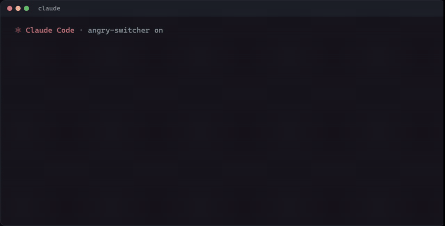

<div align="center">

# Angry Switcher

**Матерись на Claude Code сколько хочешь. Он прочитает чистый текст.**

[](LICENSE)
[](https://github.com/timoncool/angry-switcher/stargazers)
[](https://github.com/timoncool/angry-switcher/commits)
[](https://timoncool.github.io/angry-switcher/ru.html)

**[English](README.md)** · **[Русский](README_RU.md)**



</div>

Angry Switcher — плагин для Claude Code, который переписывает каждый промпт до того, как его прочитает Claude. Опечатки, транслит, не та раскладка, мат и капс уходят; каждая просьба, вопрос, путь и число остаются. Как Punto Switcher для промптов, только умнее: он исправляет не раскладку, а всё сообщение.

## С чего всё началось

8 октября 2026 года Anthropic [обновила правила использования](https://techcrunch.com/2026/10/08/anthropic-changes-usage-policy-to-ban-model-abuse-and-election-interference/): систематическая бессмысленная жестокость к её моделям теперь под запретом. Многие матерятся на Claude Code, потому что кажется, что так работает лучше. Мы проверили исследования: тон почти не влияет на качество ответа, а в ругани нет диагностики. Поэтому между клавиатурой и Claude теперь стоит маленькая быстрая модель.

## Возможности

- **Чистит:** опечатки, транслит (`pochini test`), раскладку (`ghbdtn` → `привет`), мат, капс, воду
- **Правит, а не пересказывает:** вопрос остаётся вопросом, просьба просьбой, ничего не добавляется
- **Не теряет детали:** пути, идентификаторы, числа, код и цитаты обязаны сохраниться, иначе уходит оригинал
- **Оригинал рядом:** сначала чистый текст, ниже твои слова в блоке `<original>` с мат под звёздочками, и Claude знает, что при расхождении верить нужно оригиналу (`/angry original off` отправляет только чистый текст)
- **Учится твоему стилю:** твои правила и одобренные образцы
- **Считает расходы:** токены, деньги, доля в сессии, окна лимитов подписки
- **A/B и тестовая комната:** сравнение с промптами как написано; прогон старых промптов без отправки

## Быстрый старт

Вставь в Claude Code:

```text
Install the Claude Code plugin Angry Switcher from https://github.com/timoncool/angry-switcher: run /plugin marketplace add timoncool/angry-switcher, then /plugin install angry-switcher@angry-switcher, then run /angry and show me its status. Remind me to restart Claude Code if the /angry command does not appear.
```

Или вручную:

```text
/plugin marketplace add timoncool/angry-switcher
/plugin install angry-switcher@angry-switcher
```

**На подписке Claude никаких доплат.** Плагин работает через твой логин Claude, поэтому на Pro или Max его вызовы идут из той же подписки, а Sonnet на низком уровне размышлений настолько дешёвый, что это даже не ощущается: около $0.0015 за сообщение по ценам API.

### DeepSeek вместо Sonnet

Чистку можно перевести на DeepSeek V4.1 Flash по твоему ключу, и тогда мат вообще не доходит до Anthropic. Ключ задаётся один раз, в терминале (он уходит в защищённое хранилище Claude Code, а не в файл):

```bash
echo '{"deepseek_api_key":"sk-..."}' | claude plugin configure angry-switcher@angry-switcher --values-stdin
```

Потом `/angry model deepseek` переключает слой на DeepSeek, а `/angry model sonnet` возвращает обратно. Цена выбора, замер на одних и тех же 22 настоящих сообщениях: Sonnet на низком уровне размышлений тратит 1,9 с на сообщение (медиана), DeepSeek на низком уровне размышлений 3,4 с с длинным хвостом, и примерно каждое десятое сообщение не укладывается в 8 с и уходит как написано. Без размышлений DeepSeek отвечает за 1 с, но оставляет угрозы и угадывает слова, поэтому слой этот режим не использует. DeepSeek списывает деньги с твоего ключа: около $0.30 за миллион входных токенов и $1.20 за миллион выходных по обычному тарифу.

`/ask <вопрос>` отправляет вопрос прямо в DeepSeek, мимо Claude, по тому же ключу: пригодится, когда Claude в чём-то отказывает.

## Команды

| Команда | Что делает |
|---|---|
| `/angry` | статус, модель, траты за сутки |
| `/angry on` / `off` | включить или выключить |
| `/angry original on` / `off` | прикладывать оригинал к чистому тексту (по умолчанию да) |
| `/angry card on` / `off` | карточка «ты написал / ушло» |
| `/angry model sonnet` / `deepseek` | чистить через Sonnet по подписке (по умолчанию) или через DeepSeek по своему ключу |
| `/ask <вопрос>` | спросить DeepSeek напрямую, мимо Claude |
| `/angry lang keep` / `en` | оставлять язык или отправлять на английском (ответ на твоём) |
| `/angry style <правила>` | твои правила переписывания |
| `/angry good` / `fix <текст>` | сохранить последнее переписывание или свой исправленный вариант как образец |
| `/angry examples` / `forget <n>` | список образцов, удалить образец |
| `/angry ab raw` / `en` / `off` | A/B: половина промптов уходит как написано (или на английском), всё в лог |
| `/angry report` | сравнение A/B |
| `/angry cost` | токены, деньги, доля в сессии, лимиты |
| `/angry export` | лог в JSONL |
| `/angry replay <файл>` | тестовая комната: прогнать промпты из JSONL, ничего не отправляя; Claude может запустить её сам через инструмент плагина `replay` |
| `raw:` в начале | отправить ровно как написано |

## Как это работает

1. Локальная проверка без токенов решает, нужна ли работа: «мусор» любой длины или длинный размытый промпт.
2. Блоки кода, вставленный текст и цитаты ответов заменяются метками.
3. Claude Sonnet 5.5 на низком уровне размышлений правит промпт как можно меньше.
4. Переписанное уходит, только если вернулись все метки и защищённые детали; иначе уходит оригинал с уведомлением.
5. Под переписанным идёт твой оригинал, мат в нём закрывает та же модель, а строка в системном промпте Claude говорит верить ему при расхождении.
6. После трёх сбоев подряд слой встаёт на паузу на 10 минут, чтобы не тормозить работу.

## Что мы замерили

Вручную, на настоящих сообщениях: каждому переписыванию ставилась доля смысла, которая дошла.

| Что | Результат |
|---|---|
| Смысл сохранён, 51 настоящее сообщение из двух живых чатов | 97-100% |
| Смысл сохранён, 40 более старых сообщений | 96-98% |
| Время чистки одного сообщения, медиана | 1,4 с |
| Цена одного сообщения по ценам API | около $0.0015 |

Один и тот же промпт от прогона к прогону выходит чуть по-разному, поэтому колебания на 1-2% это шум.

**Плюсы:** чистые промпты; раскладка и транслит расшифровываются; детали сохраняются, иначе уходит оригинал; Claude видит оригинал и сам ловит ошибку чистки.
**Минусы:** около 1,4 с на каждое очищенное сообщение; сильно искажённые опечатки иногда читаются неверно; пропущенное чистильщиком слово мата дойдёт до Claude в оригинале; только Claude Code, не чат claude.ai.

На какие исследования опирались: в среднем тон почти не влияет на точность ([arXiv 2508.00614](https://arxiv.org/abs/2508.00614)); эффект тона есть только в гуманитарных задачах, в STEM нет ([arXiv 2512.12812](https://arxiv.org/abs/2512.12812)); минимальные правки вредят намного реже агрессивных ([arXiv 2603.13301](https://arxiv.org/abs/2603.13301)).

## Благодарности

- [Prompt Forge](https://github.com/tomikng/prompt-forge) (tomikng) — ядро подмены через `prompt.submit`, из которого вырос плагин (MIT)
- [claude-prompt-improver](https://github.com/GaZmagik/claude-prompt-improver), [prompt-preflight](https://github.com/AnotherSamWithADream/prompt-preflight), [claude-code-prompt-optimizer](https://github.com/0-to-1-Labs/claude-code-prompt-optimizer), [claude-code-prompt-improver](https://github.com/severity1/claude-code-prompt-improver) — идеи типов задач, образцов, предохранителя и защиты от инъекций

## Другие проекты [@timoncool](https://github.com/timoncool)

| Проект | Описание |
|--------|----------|
| [telegram-api-mcp](https://github.com/timoncool/telegram-api-mcp) | Telegram Bot API как MCP-сервер |
| [civitai-mcp-ultimate](https://github.com/timoncool/civitai-mcp-ultimate) | Civitai API как MCP-сервер |
| [trail-spec](https://github.com/timoncool/trail-spec) | TRAIL — протокол трекинга контента |
| [ACE-Step Studio](https://github.com/timoncool/ACE-Step-Studio) | AI-студия музыки — песни, вокал, каверы, клипы |
| [VideoSOS](https://github.com/timoncool/videosos) | AI-видеопродакшн в браузере |

## Авторы

- **Nerual Dreming** — [Telegram](https://t.me/nerual_dreming) | [neuro-cartel.com](https://neuro-cartel.com) | [ArtGeneration.me](https://artgeneration.me)

## Поддержать автора

Я создаю опенсорс софт и занимаюсь исследованиями в области ИИ. Большая часть всего, что я делаю, находится в открытом доступе. Ваши пожертвования позволяют мне создавать и исследовать больше, не отвлекаясь на поиск еды для продолжения существования =)

**[Все способы поддержки](https://github.com/timoncool/ACE-Step-Studio/blob/master/DONATE.md)** | **[dalink.to/nerual_dreming](https://dalink.to/nerual_dreming)** | **[boosty.to/neuro_art](https://boosty.to/neuro_art)**

- **BTC:** `1E7dHL22RpyhJGVpcvKdbyZgksSYkYeEBC`
- **ETH (ERC20):** `0xb5db65adf478983186d4897ba92fe2c25c594a0c`
- **USDT (TRC20):** `TQST9Lp2TjK6FiVkn4fwfGUee7NmkxEE7C`

## Star History

<a href="https://github.com/timoncool/angry-switcher/stargazers">
 <picture>
   <source media="(prefers-color-scheme: dark)" srcset="docs/stars-dark.svg" />
   <source media="(prefers-color-scheme: light)" srcset="docs/stars-light.svg" />
   
 </picture>
</a>

## Лицензия

MIT. Часть кода — tomikng (Prompt Forge).
